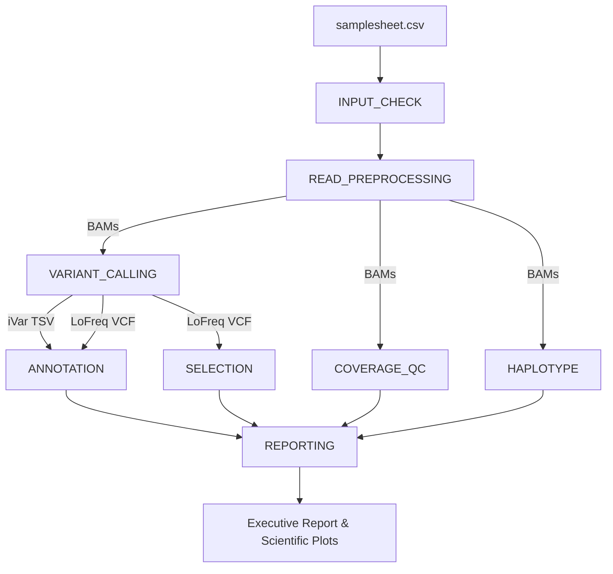

# ARCHITECTURE.md — System Architecture & Design Specification

`viral-intrahost-variant-workflow` is a production Nextflow DSL2 pipeline engineered for ultra-deep (≥1,000×) viral intra-host variant calling (iSNV), quasispecies haplotype reconstruction, and downstream evolutionary selection analysis.

---

## 1. High-Level Directed Acyclic Graph (DAG)



---

## 2. Modular Subworkflow Architecture

The pipeline follows strict Nextflow DSL2 modularity conventions:

| Subworkflow | Responsibility | Key Tools / Modules |
|---|---|---|
| **`INPUT_CHECK`** | Validates CSV samplesheet structure (`sample,fastq_1,fastq_2,treatment`) and verifies reference FASTA/GFF3 existence. | `plugin/nf-schema` |
| **`READ_PREPROCESSING`** | Performs adapter/quality trimming, aligns paired FASTQ reads against the viral reference, sorts and indexes BAMs, and extracts target viral contig alignments. | `fastp`, `bwa mem`, `samtools` |
| **`VARIANT_CALLING`** | Executes parallelized variant calling with no artificial allele frequency floors on raw pileups. | `lofreq call-parallel`, `lofreq filter`, `ivar variants`, `ivar consensus` |
| **`ANNOTATION`** | Converts iVar TSV outputs to valid VCFs and annotates variant consequences in haploid viral coding sequences. | `ivar_variants_to_vcf.py`, `bcftools csq` |
| **`COVERAGE_QC`** | Calculates per-base depth statistics, target coverage fractions, and mean depth metrics. | `samtools depth`, `generate_coverage_plots.py` |
| **`SELECTION`** | Executes SNPGenie per-sample for nucleotide diversity ($\pi_N$, $\pi_S$) and $d_N/d_S$ ratios, followed by non-parametric Kruskal-Wallis & limma differential selection analysis. | `SNPGenie` (Perl), `analyze_delta_selection.py`, `analyze_delta_limma.R` |
| **`HAPLOTYPE`** | Reconstructs quasispecies haplotypes and estimates intra-host viral quasispecies diversity. | `CliqueSNV`, `VILOCA` / `ShoRAH` |
| **`REPORTING`** | Consolidates workflow metrics, computes percentage frequency tiers (`>=1%`, `0.1-1% candidate`, `<0.1% exploratory`), and outputs publication-ready plots. | `generate_variant_plots.py`, `generate_run_summary.py`, MultiQC |

---

## 3. Data Storage & Reporting Units Contract

To eliminate ambiguity between raw machine representations and human-facing summaries, the pipeline enforces a strict data contract:

* **Machine Files (VCF, TSV, BAM, BCFTools outputs)**: All allele frequency values are stored strictly as **proportions** ($0.0$ to $1.0$).
* **Human-Facing Reports & Visualizations**: All summary tables, executive reports, and plots convert values to **percentages** ($100 \times \text{proportion}$) and explicitly include `%` units in column headers and axis labels.

---

## 4. Container & Governance Model

All process executions are isolated within containerized environments using pinned Biocontainers image digests recorded in `conf/containers.config`. Untagged image usage or `latest` tags are prohibited and strictly checked via `tests/lint_containers.sh`.

```groovy
params {
    container_samtools         = 'quay.io/biocontainers/samtools:1.21--h50ea8bc_0'
    container_lofreq           = 'quay.io/biocontainers/lofreq:2.1.5--py310hef9f4f8_16'
    container_ivar             = 'quay.io/biocontainers/ivar:1.4.4--h077b44d_0'
    container_python_reporting = 'quay.io/biocontainers/seaborn:0.13.2'
}
```

---

## 5. Execution Profiles

* **`test`**: Synthetic local test profile running mini FASTQ fixtures via Docker.
* **`docker` / `singularity`**: Container execution profiles for local or server environments.
* **`slurm`**: High-performance computing profile using SLURM job submission.
* **`awsbatch`**: Cloud template profile for AWS Batch execution (requires queue and S3 work directory configuration).
