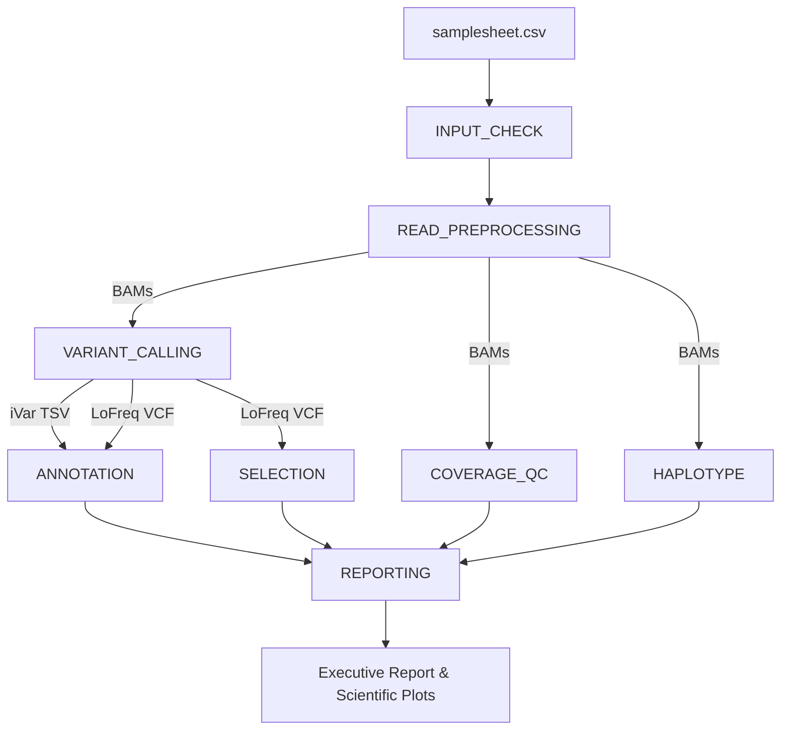
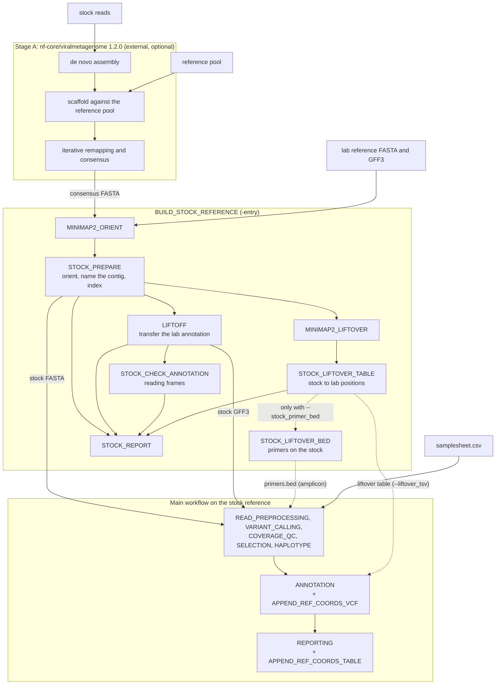

# ARCHITECTURE.md — System Architecture & Design Specification

`viral-intrahost-variant-workflow` is a production Nextflow DSL2 pipeline engineered for ultra-deep (≥1,000×) viral intra-host variant calling (iSNV), quasispecies haplotype reconstruction, and downstream evolutionary selection analysis.

---

## 1. High-Level Directed Acyclic Graph (DAG)


```mermaid
flowchart TD
    A[samplesheet.csv] --> B[INPUT_CHECK]
    B --> C[READ_PREPROCESSING]
    C -->|BAMs| D[VARIANT_CALLING]
    C -->|BAMs| E[COVERAGE_QC]
    
    D -->|iVar TSV| F[ANNOTATION]
    D -->|LoFreq VCF| F
    
    D -->|LoFreq VCF| G[SELECTION]
    C -->|BAMs| H[HAPLOTYPE]
    
    F & E & G & H --> I[REPORTING]
    I --> J[Executive Report & Scientific Plots]
```

### Stock workflow (`scripts/run_stock_workflow.sh`)

Three separate Nextflow runs joined by files. Stage A is an external pipeline and is optional:
`--consensus` supplies a consensus and skips it. The main workflow above runs unchanged on the
stock reference.


```mermaid
flowchart TD
    subgraph A["Stage A: nf-core/viralmetagenome 1.2.0 (external, optional)"]
        A1["de novo assembly"] --> A2["scaffold against the reference pool"] --> A3["iterative remapping and consensus"]
    end
    subgraph G["BUILD_STOCK_REFERENCE (-entry)"]
        G1["MINIMAP2_ORIENT"] --> G2["STOCK_PREPARE<br/>orient, name the contig, index"]
        G2 --> G3["LIFTOFF<br/>transfer the lab annotation"]
        G3 --> G4["STOCK_CHECK_ANNOTATION<br/>reading frames"]
        G2 --> G5["MINIMAP2_LIFTOVER"] --> G6["STOCK_LIFTOVER_TABLE<br/>stock to lab positions"]
        G6 -.->|"only with --stock_primer_bed"| G7["STOCK_LIFTOVER_BED<br/>primers on the stock"]
        G2 & G3 & G4 & G6 --> G8["STOCK_REPORT"]
    end
    subgraph M["Main workflow on the stock reference"]
        M1["READ_PREPROCESSING, VARIANT_CALLING,<br/>COVERAGE_QC, SELECTION, HAPLOTYPE"] --> M2["ANNOTATION<br/>+ APPEND_REF_COORDS_VCF"]
        M2 --> M3["REPORTING<br/>+ APPEND_REF_COORDS_TABLE"]
    end
    READS["stock reads"] --> A1
    POOL["reference pool"] --> A2
    A3 -->|consensus FASTA| G1
    LAB["lab reference FASTA and GFF3"] --> G1
    G2 -->|stock FASTA| M1
    G3 -->|stock GFF3| M1
    G6 -.->|"liftover table (--liftover_tsv)"| M2
    G7 -.->|"primers.bed (amplicon)"| M1
    SAMPLES["samplesheet.csv"] --> M1
```

---

## 2. Modular Subworkflow Architecture

The pipeline follows strict Nextflow DSL2 modularity conventions:

| Subworkflow | Responsibility | Key Tools / Modules |
|---|---|---|
| **`INPUT_CHECK`** | Validates CSV samplesheet structure (`sample,fastq_1,fastq_2,treatment`) and verifies reference FASTA/GFF3 existence. | `plugin/nf-schema` |
| **`READ_PREPROCESSING`** | Performs adapter/quality trimming, aligns paired FASTQ reads against the viral reference, sorts and indexes BAMs, and extracts target viral contig alignments. | `fastp`, `bwa mem`, `samtools` |
| **`VARIANT_CALLING`** | Executes parallelized variant calling with no artificial allele frequency floors on raw pileups. `lofreq filter` applies a quality cutoff and a strand-bias rule. `--lofreq_sb_thresh` swaps LoFreq's built-in rule for a fixed phred cutoff when set above 0. The default, `0`, keeps the built-in rule. Either rule drops a call only when about 85% of its alt reads also sit on one strand. | `lofreq call-parallel`, `lofreq filter`, `ivar variants`, `ivar consensus` |
| **`ANNOTATION`** | Converts iVar TSV outputs to valid VCFs (indels as anchored VCF alleles), left-aligns indels, and annotates variant consequences in haploid viral coding sequences. With `--liftover_tsv`, each annotated VCF is also written with lab-reference coordinates (`REF_CONTIG`, `REF_POS`, `REF_END`, `REF_STATUS`). | `ivar_variants_to_vcf.py`, `bcftools reheader`, `bcftools norm`, `bcftools csq`, `append_ref_coords.py` |
| **`COVERAGE_QC`** | Calculates per-base depth statistics, target coverage fractions, and mean depth metrics. | `samtools depth`, `generate_coverage_plots.py` |
| **`SELECTION`** | Executes SNPGenie per-sample for nucleotide diversity ($\pi_N$, $\pi_S$) and $d_N/d_S$ ratios, followed by non-parametric Kruskal-Wallis & limma differential selection analysis. | `SNPGenie` (Perl), `analyze_delta_selection.py`, `analyze_delta_limma.R` |
| **`HAPLOTYPE`** | Reconstructs quasispecies haplotypes and estimates intra-host viral quasispecies diversity. | `CliqueSNV`, `VILOCA` |
| **`REPORTING`** | Consolidates workflow metrics, computes percentage frequency tiers (`>=1%`, `0.1-1% candidate`, `<0.1% exploratory`), and outputs publication-ready plots & haplotype network summaries. With `--liftover_tsv`, the variant summary table is also written with `ref_contig`, `ref_pos`, `ref_end` and `ref_status` columns. | `generate_variant_plots.py`, `append_ref_coords.py`, `build_haplotype_tables.py`, `summarize_linked_mutations.py`, `plot_haplotypes.py`, MultiQC |
| **`STOCK_REFERENCE`** | Builds a per-stock reference from a de novo consensus: orients it against the lab reference, names and indexes the contig, transfers the lab annotation, checks the transfer against the reference as a control, maps every position back to the lab reference, moves a primer scheme onto the stock when one is given, and writes one report per stock. Run through `-entry BUILD_STOCK_REFERENCE`, not as part of the main DAG. | `samtools faidx`, `Liftoff`, `minimap2`, `check_lifted_annotation.py`, `build_liftover_table.py`, `liftover_bed.py`, `summarize_stock_reference.py` |
| **`scripts/run_stock_workflow.sh`** | A launcher, not a subworkflow. Chains Stage A, `BUILD_STOCK_REFERENCE` and the main workflow for one stock as three separate Nextflow runs joined by files. Stage A is nf-core/viralmetagenome 1.2.0, run unchanged and optional. | `nextflow`, `nf-core/viralmetagenome` |

---

## 3. Data Storage & Reporting Units Contract

To eliminate ambiguity between raw machine representations and human-facing summaries, the pipeline enforces a strict data contract:

* **Machine Files (VCF, TSV, BAM, BCFTools outputs)**: All allele frequency values are stored strictly as **proportions** ($0.0$ to $1.0$).
* **Human-Facing Reports & Visualizations**: All summary tables, executive reports, and plots convert values to **percentages** ($100 \times \text{proportion}$) and explicitly include `%` units in column headers and axis labels.

---

## 4. Container & Governance Model

All process executions are isolated within containerized environments using pinned Biocontainers image digests recorded in `conf/containers.config`. Untagged image usage or `latest` tags are prohibited and strictly checked via `tests/lint_containers.sh`.

```groovy
params {
    container_samtools         = 'quay.io/biocontainers/samtools:1.21--h50ea8bc_0'
    container_lofreq           = 'quay.io/biocontainers/lofreq:2.1.5--py310hef9f4f8_16'
    container_ivar             = 'quay.io/biocontainers/ivar:1.4.4--h077b44d_0'
    container_python_reporting = 'quay.io/biocontainers/seaborn:0.13.2'
}
```

---

## 5. Execution Profiles

* **`test`**: Synthetic local test profile running mini FASTQ fixtures via Docker.
* **`docker` / `singularity`**: Container execution profiles for local or server environments.
* **`slurm`**: High-performance computing profile using SLURM job submission.
* **`awsbatch`**: Cloud template profile for AWS Batch execution (requires queue and S3 work directory configuration).
