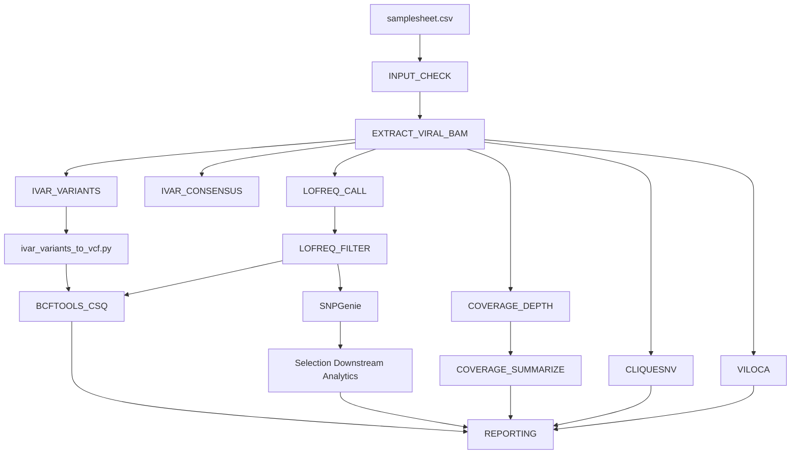

# viral-intrahost-variant-workflow


Containerized Nextflow DSL2 workflow for viral intra-host variant calling (iSNV), quasispecies haplotype reconstruction, and evolutionary selection analysis.

> [!NOTE]
> **Note on Organism Compatibility**: Although named and validated on Alphavirus datasets (VEEV, EEEV), the pipeline engine is virus-agnostic. It processes any haploid viral genome given a valid reference FASTA and GFF3 annotation file.

---

## Architecture Overview



---

## Quick Start

1. **Install Nextflow** (≥24.04.0) and **Docker** (or Singularity/Apptainer):
   ```bash
   curl -s https://get.nextflow.io | bash
   ```

2. **Run test dataset**:
   ```bash
   nextflow run . -profile test
   ```

3. **Run on custom dataset**:
   ```bash
   nextflow run . \
     -profile docker \
     --input samplesheet.csv \
     --fasta reference.fasta \
     --gff reference.gff3 \
     --outdir ./results
   ```

---

## Usage & Execution Profiles

### Samplesheet Format (`--input`)

The pipeline requires a CSV samplesheet specifying raw or trimmed paired-end FASTQ reads and experimental group treatment labels for downstream evolutionary selection analysis.

| Field | Description | Required | Example |
|---|---|---|---|
| `sample` | Unique sample identifier | Yes | `sampleA` |
| `fastq_1` | Path to R1 FASTQ file (`.fastq.gz`) | Yes | `data/sampleA_1.fastq.gz` |
| `fastq_2` | Path to R2 FASTQ file (`.fastq.gz`) | Yes | `data/sampleA_2.fastq.gz` |
| `treatment` | Experimental group / condition label | Optional* | `infected` |

*\* Required when `--run_snpgenie true` is enabled for group comparison.*

Example `samplesheet.csv`:
```csv
sample,fastq_1,fastq_2,treatment
sampleA,data/sampleA_1.fastq.gz,data/sampleA_2.fastq.gz,infected
sampleB,data/sampleB_1.fastq.gz,data/sampleB_2.fastq.gz,infected
```


### Pipeline Parameters

| Parameter | Default | Description |
|---|---|---|
| `--input` | `null` | Path to samplesheet CSV |
| `--fasta` | `null` | Reference FASTA file |
| `--gff` | `null` | Annotation GFF3 file (must contain `CDS` features) |
| `--outdir` | `./results` | Directory for published results |
| `--dataset` | `viral_analysis` | Dataset label used in reporting outputs |
| `--viral_contig` | `null` | Target viral contig name (extracted dynamically if null) |
| `--publish_dir_mode` | `copy` | Method for publishing output files (`copy`, `symlink`, `link`) |
| `--ivar_min_depth` | `10` | Minimum depth threshold to examine positions for iVar variant calling |
| `--ivar_min_freq` | `0.001` | Minimum allele frequency to report for iVar (proportion 0-1) |
| `--ivar_min_bq` | `30` | Minimum base quality for iVar |
| `--ivar_consensus_min_cov` | `10` | Minimum depth for iVar consensus calling |
| `--ivar_consensus_threshold` | `0.5` | Threshold for iVar consensus calling |
| `--lofreq_min_depth` | `10` | Minimum depth threshold for LoFreq variant calling |
| `--lofreq_min_bq` | `30` | Minimum base quality for LoFreq |
| `--lofreq_min_mq` | `20` | Minimum mapping quality for LoFreq |
| `--lofreq_sig` | `0.01` | LoFreq significance threshold |
| `--lofreq_enable_indelqual` | `false` | Enable LoFreq indel quality assessment |
| `--lofreq_enable_baq` | `false` | Enable LoFreq base alignment quality (BAQ) |
| `--viloca_window` | `150` | Window size for VILOCA local quasispecies reconstruction |
| `--viloca_shift` | `50` | Window shift step for VILOCA local quasispecies reconstruction |
| `--cliquesnv_min_freq` | `0.001` | Minimum frequency threshold for CliqueSNV |
| `--haplotype_report_min_freq` | `0.01` | Minimum frequency threshold (proportion 0-1) for reporting confirmed haplotypes |
| `--viloca_min_pair_samples` | `2` | Minimum sample threshold for recurrent linked mutation pair classification |
| `--viloca_min_pair_support` | `0.80` | Minimum posterior support threshold for VILOCA linked mutation pair reporting |
| `--viloca_min_reads` | `10.0` | Minimum read count threshold for VILOCA linked mutation pair reporting |
| `--run_ivar` | `true` | Enable iVar subworkflow |
| `--run_lofreq` | `true` | Enable LoFreq subworkflow |
| `--run_annotation` | `true` | Enable variant functional annotation (`bcftools csq`) |
| `--run_coverage` | `true` | Enable depth and coverage QC subworkflow |
| `--run_snpgenie` | `false` | Enable SNPGenie evolutionary selection subworkflow |
| `--run_haplotype` | `false` | Enable CliqueSNV & VILOCA haplotype reconstruction |

### Methodology & Reporting Tiers

- **Frequency Reporting Contract:** All machine-readable files (VCFs, raw TSVs) store allele frequencies strictly as proportions (`0.0` to `1.0`). All human-facing summary tables, reports, and visualization plots convert values to percentages (`100 × proportion`) with explicit `%` unit labels.
- **Reporting Tiers & Classification:**
  - `≥ 1.0%`: **Primary reporting tier.** Candidate minor variant calls passing caller statistical significance models, primer masking, depth thresholds, and strand-bias filtering.
  - `0.1% – 1.0%`: **Candidate low-frequency tier.** Low-frequency candidate iSNVs requiring (1) caller statistical significance (e.g., LoFreq Poisson-binomial model), (2) strand-balance pass, and (3) sufficient ALT-supporting read depth (e.g., ≥10 ALT reads, requiring total depth ≥10,000×).
  - `< 0.1%`: **Exploratory tier.** Below routine assay sensitivity limits; reported for exploratory candidate screening only.
- **Assay Controls & Validation Notice:** Computational allele frequency cutoffs alone do not constitute biological or experimental confirmation. Systematic sequencing errors, PCR amplification bias, primer artifacts, mapping ambiguity, and library preparation noise are not fully captured by nominal base quality scores (Q30). Reportable diagnostic or clinical thresholds must be established using assay-specific controls, technical replicates, empirical error profiles, and study-specific validation. (Note: Multi-replicate concordance filtering is executed in study-specific downstream statistical modules and is not automated within this single-pass execution engine.)
- **Indel Scope:** By default, LoFreq runs with `lofreq_enable_indelqual = false`. Unqualified indels are filtered out by `--indelqual-thresh 20`, ensuring the pipeline operates in an iSNV / SNV-focused mode unless indel qualities are explicitly calculated.

### Execution Profiles

- **Local / Test Profile (`test`)**:
  ```bash
  nextflow run . -profile test
  ```
  Runs on tiny bundled synthetic test fixtures with Docker. All workflow branches are enabled.

- **SLURM HPC Profile (`slurm`)**:
  ```bash
  nextflow run . -profile slurm --input samplesheet.csv --fasta ref.fa --gff ref.gff3
  ```
  Executes jobs via SLURM scheduler using Singularity containers.

- **AWS Batch Cloud Profile (`awsbatch`)**: *(Unvalidated Template)*
  ```bash
  nextflow run . -profile awsbatch -w s3://my-bucket/work --input s3://my-bucket/samplesheet.csv --fasta s3://my-bucket/ref.fa --gff s3://my-bucket/ref.gff3
  ```
  Example configuration template for AWS Batch container execution with S3 storage. Adjust queue name and AWS CLI paths in `conf/awsbatch.config` for your infrastructure before deployment.

---

## Output Layout

Results are published directly under the specified output directory:

```
results/
├── LoFreq/
│   └── <sample>/
│       ├── variants.filtered.vcf.gz
│       ├── variants.filtered.vcf.gz.tbi
│       └── qc_stats.txt
├── Ivar/
│   └── <sample>/
│       ├── variants.tsv
│       └── consensus.fa
├── Annotated_variants/
│   ├── LoFreq/
│   └── Ivar/
├── Coverage/
│   └── <sample>/
│       ├── depth.tsv
│       └── coverage_summary.tsv
├── SNPGenie/       (optional)
├── Haplotypes/     (optional)
│   ├── CliqueSNV/
│   ├── VILOCA/
│   └── tables/
│       ├── haplotype_frequency_by_sample.csv
│       ├── haplotype_summary.csv
│       ├── haplotype_sequences.fasta
│       ├── linked_mutations_long.csv
│       └── linked_mutations_recurrent.csv
├── Reports/
│   ├── tables/
│   └── Plots/
│       ├── <dataset>_haplotype_frequencies.png
│       └── <dataset>_haplotype_network.png
├── MultiQC/
└── pipeline_info/
```

---

## Container Policy

All processes execute inside containerized environments with fully pinned quay.io Biocontainers image tags configured in `conf/containers.config`. Untagged or `latest` images are strictly prohibited and enforced by CI lint checks (`tests/lint_containers.sh`).

---

## Test Fixtures & Validation Scope

- **Synthetic Test Scope**: Deterministic synthetic test fixtures are generated via `tests/data/generate_fixtures.sh` using containerized tools. The automated CI suite (`-profile test`) uses these synthetic downsampled FASTQ fixtures to verify process execution, data contract adherence, schema validation, and figure generation.
- **Operational Validation Scope**: The core variant calling (LoFreq / iVar) and selection analysis (SNPGenie) subworkflows have been operationally validated on real Alphavirus (VEEV, EEEV) sequencing study datasets under institutional SLURM HPC environments (`-profile slurm`). Optional quasispecies haplotype reconstruction modules (ShoRAH / CliqueSNV) are provided as exploratory analysis tools and require parameter tuning for specific target viral read lengths and depth profiles.

To regenerate test datasets:

```bash
bash tests/data/generate_fixtures.sh
```

---

## Migration Mapping (Legacy Scripts → DSL2 Modules)

| Legacy Script / Helper | Nextflow DSL2 Component |
|---|---|
| `Scripts/extract_viral_bams.sh` | `modules/local/extract_viral_bam` |
| `Scripts/run_lofreq.sh` | `modules/local/lofreq/call`, `modules/local/lofreq/filter` |
| `Scripts/run_ivar.sh` | `modules/local/ivar/variants`, `modules/local/ivar/consensus` |
| `Scripts/annotate_all.sh` | `modules/local/bcftools/csq`, `bin/ivar_variants_to_vcf.py` |
| `Scripts/calculate_coverage.sh` | `modules/local/coverage/depth`, `modules/local/coverage/summarize` |
| `Scripts/run_snpgenie.sh` | `subworkflows/local/selection` (`snpgenie/run` + 4 `bin/` scripts) |
| `Scripts/run_cliquesnv.sh` | `modules/local/cliquesnv` |
| `Scripts/run_viloca.sh` | `modules/local/viloca` |
| `Scripts/Helpers/*.py`, `*.R` | Ported to executable `bin/` scripts with strict argparse CLIs |

---

### Contact & Maintainer
**Alejandro Ponce-Flores**  
- GitHub: [@aleponce4](https://github.com/aleponce4)
- License: MIT

