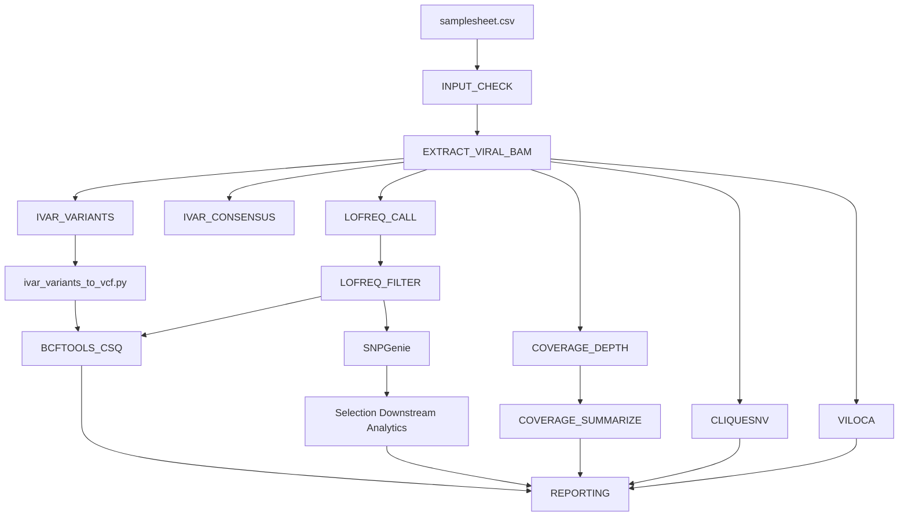

# alphavirus-variant-analysis-workflow


Containerized Nextflow DSL2 workflow for viral intra-host variant calling (iSNV), quasispecies haplotype reconstruction, and evolutionary selection analysis.

> [!NOTE]
> **Note on Organism Compatibility**: Although named and validated on Alphavirus datasets (VEEV, EEEV), the pipeline engine is virus-agnostic. It processes any haploid viral genome given a valid reference FASTA and GFF3 annotation file.

---

## Architecture Overview



---

## Quick Start

1. **Install Nextflow** (≥24.04.0) and **Docker** (or Singularity/Apptainer):
   ```bash
   curl -s https://get.nextflow.io | bash
   ```

2. **Run test dataset**:
   ```bash
   nextflow run . -profile test
   ```

3. **Run on custom dataset**:
   ```bash
   nextflow run . \
     -profile docker \
     --input samplesheet.csv \
     --fasta reference.fasta \
     --gff reference.gff3 \
     --outdir ./results
   ```

---

## Usage & Execution Profiles

### Samplesheet Format (`--input`)

The pipeline requires a CSV samplesheet specifying input BAM files and optional metadata for downstream selection analysis.

| Field | Description | Required | Example |
|---|---|---|---|
| `sample` | Unique sample identifier | Yes | `sampleA` |
| `bam` | Path to STAR-aligned viral BAM file | Yes | `data/sampleA.bam` |
| `bai` | Path to BAM index file (`.bai`) | Yes | `data/sampleA.bam.bai` |
| `condition` | Experimental group / condition | Optional* | `infected` |
| `dpi` | Days post-infection (numeric) | Optional* | `3` |

*\* Required when `--run_snpgenie true` is enabled.*

Example `samplesheet.csv`:
```csv
sample,bam,bai,condition,dpi
sampleA,data/sampleA.bam,data/sampleA.bam.bai,infected,3
sampleB,data/sampleB.bam,data/sampleB.bam.bai,infected,7
```

### Pipeline Parameters

| Parameter | Default | Description |
|---|---|---|
| `--input` | `null` | Path to samplesheet CSV |
| `--fasta` | `null` | Reference FASTA file |
| `--gff` | `null` | Annotation GFF3 file (must contain `CDS` features) |
| `--outdir` | `./results` | Directory for published results |
| `--dataset` | `viral_analysis` | Dataset label used in reporting outputs |
| `--viral_contig` | `null` | Target viral contig name (extracted dynamically if null) |
| `--publish_dir_mode` | `copy` | Method for publishing output files (`copy`, `symlink`, `link`) |
| `--ivar_min_depth` | `1000` | Minimum depth for iVar variant calling |
| `--ivar_min_freq` | `0.01` | Minimum allele frequency for iVar |
| `--ivar_min_bq` | `30` | Minimum base quality for iVar |
| `--ivar_consensus_min_cov` | `10` | Minimum depth for iVar consensus calling |
| `--ivar_consensus_threshold` | `0.5` | Threshold for iVar consensus calling |
| `--lofreq_min_depth` | `1000` | Minimum depth for LoFreq variant calling |
| `--lofreq_min_freq` | `0.01` | Minimum allele frequency for LoFreq |
| `--lofreq_min_bq` | `30` | Minimum base quality for LoFreq |
| `--lofreq_min_mq` | `60` | Minimum mapping quality for LoFreq |
| `--lofreq_sig` | `0.01` | LoFreq significance threshold |
| `--lofreq_enable_indelqual` | `false` | Enable LoFreq indel quality assessment |
| `--lofreq_enable_baq` | `false` | Enable LoFreq base alignment quality (BAQ) |
| `--run_ivar` | `true` | Enable iVar subworkflow |
| `--run_lofreq` | `true` | Enable LoFreq subworkflow |
| `--run_annotation` | `true` | Enable variant functional annotation (`bcftools csq`) |
| `--run_coverage` | `true` | Enable depth and coverage QC subworkflow |
| `--run_snpgenie` | `false` | Enable SNPGenie evolutionary selection subworkflow |
| `--run_haplotype` | `false` | Enable CliqueSNV & VILOCA haplotype reconstruction |

### Execution Profiles

- **Local / Test Profile (`test`)**:
  ```bash
  nextflow run . -profile test
  ```
  Runs on tiny bundled synthetic test fixtures with Docker. All workflow branches are enabled.

- **SLURM HPC Profile (`slurm`)**:
  ```bash
  nextflow run . -profile slurm --input samplesheet.csv --fasta ref.fa --gff ref.gff3
  ```
  Executes jobs via SLURM scheduler using Singularity containers.

- **AWS Batch Cloud Profile (`awsbatch`)**:
  ```bash
  nextflow run . -profile awsbatch -w s3://my-bucket/work --input s3://my-bucket/samplesheet.csv --fasta s3://my-bucket/ref.fa --gff s3://my-bucket/ref.gff3
  ```
  Executes jobs on AWS Batch container instances using Docker containers with work directory on S3.

---

## Output Layout

Results are published directly under the specified output directory:

```
results/
├── LoFreq/
│   └── <sample>/
│       ├── variants.filtered.vcf.gz
│       ├── variants.filtered.vcf.gz.tbi
│       └── qc_stats.txt
├── Ivar/
│   └── <sample>/
│       ├── variants.tsv
│       └── consensus.fa
├── Annotated_variants/
│   ├── LoFreq/
│   └── Ivar/
├── Coverage/
│   └── <sample>/
│       ├── depth.tsv
│       └── coverage_summary.tsv
├── SNPGenie/       (optional)
├── Haplotypes/     (optional)
│   ├── CliqueSNV/
│   └── VILOCA/
├── Reports/
│   ├── tables/
│   └── Plots/
├── MultiQC/
└── pipeline_info/
```

---

## Container Policy

All processes execute inside containerized environments with fully pinned quay.io Biocontainers image tags configured in `conf/containers.config`. Untagged or `latest` images are strictly prohibited and enforced by CI lint checks (`tests/lint_containers.sh`).

---

## Test Fixtures & Maintenance

Deterministic synthetic test fixtures are generated via `tests/data/generate_fixtures.sh` using containerized tools. To regenerate test datasets:

```bash
bash tests/data/generate_fixtures.sh
```

---

## Migration Mapping (Legacy Scripts → DSL2 Modules)

| Legacy Script / Helper | Nextflow DSL2 Component |
|---|---|
| `Scripts/extract_viral_bams.sh` | `modules/local/extract_viral_bam` |
| `Scripts/run_lofreq.sh` | `modules/local/lofreq/call`, `modules/local/lofreq/filter` |
| `Scripts/run_ivar.sh` | `modules/local/ivar/variants`, `modules/local/ivar/consensus` |
| `Scripts/annotate_all.sh` | `modules/local/bcftools/csq`, `bin/ivar_variants_to_vcf.py` |
| `Scripts/calculate_coverage.sh` | `modules/local/coverage/depth`, `modules/local/coverage/summarize` |
| `Scripts/run_snpgenie.sh` | `subworkflows/local/selection` (`snpgenie/run` + 4 `bin/` scripts) |
| `Scripts/run_cliquesnv.sh` | `modules/local/cliquesnv` |
| `Scripts/run_viloca.sh` | `modules/local/viloca` |
| `Scripts/Helpers/*.py`, `*.R` | Ported to executable `bin/` scripts with strict argparse CLIs |

---

### Contact & Maintainer
**Alejandro Ponce-Flores**  
Bioinformatics Analyst / Pipeline Engineer  
- GitHub: [@aleponce4](https://github.com/aleponce4)
- License: MIT

