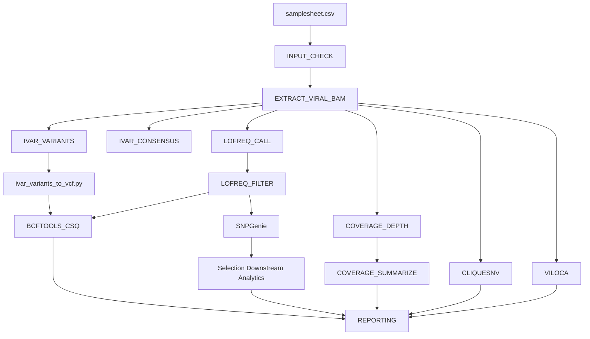

# viral-intrahost-variant-workflow


Containerized Nextflow DSL2 workflow for viral intra-host variant calling (iSNV), quasispecies haplotype reconstruction, and evolutionary selection analysis.

> [!NOTE]
> **Note on Organism Compatibility**: Although named and validated on Alphavirus datasets (VEEV, EEEV), the pipeline engine is virus-agnostic. It processes any haploid viral genome given a valid reference FASTA and GFF3 annotation file.

---

## Architecture Overview


```mermaid
flowchart TD
    A[samplesheet.csv] --> B[INPUT_CHECK]
    B --> C[EXTRACT_VIRAL_BAM]
    C --> D[IVAR_VARIANTS]
    C --> E[IVAR_CONSENSUS]
    C --> F[LOFREQ_CALL]
    F --> G[LOFREQ_FILTER]
    C --> H[COVERAGE_DEPTH] --> I[COVERAGE_SUMMARIZE]
    
    D --> J[ivar_variants_to_vcf.py] --> K[BCFTOOLS_CSQ]
    G --> K
    
    G --> L[SNPGenie] --> M[Selection Downstream Analytics]
    C --> N[CLIQUESNV]
    C --> O[VILOCA]
    
    K & I & M & N & O --> P[REPORTING]
```

---

## Quick Start

1. **Install Nextflow** (≥24.04.0) and **Docker** (or Singularity/Apptainer):
   ```bash
   curl -s https://get.nextflow.io | bash
   ```

2. **Run test dataset**:
   ```bash
   nextflow run . -profile test
   ```

3. **Run on custom dataset**:
   ```bash
   nextflow run . \
     -profile docker \
     --input samplesheet.csv \
     --fasta reference.fasta \
     --gff reference.gff3 \
     --outdir ./results
   ```

---

## Characterising a virus stock against its own sequence

The main workflow maps every sample to one reference. Describing what is inside a
laboratory virus stock needs the opposite: calls against a strain from GenBank
mix the stock's fixed differences from that strain together with the variation
inside the stock itself. Give each stock its own reference and only the second
is left.

`-entry BUILD_STOCK_REFERENCE` turns a de novo consensus for one stock into that
reference. Assemble the consensus first with an assembly pipeline such as
[nf-core/viralmetagenome](https://nf-co.re/viralmetagenome), then:

```bash
nextflow run . -entry BUILD_STOCK_REFERENCE \
  -profile docker \
  --stock_consensus stock_consensus.fasta \
  --stock_name TC83-stock \
  --fasta lab_reference.fasta \
  --gff lab_reference.gff3 \
  --outdir ./refs
```

It orients the consensus against the lab reference, names the contig after the
stock and indexes it, carries the lab annotation across with Liftoff, checks that
the transfer did not break a reading frame, and writes a position-by-position map
back to the lab reference. Outputs land in `<outdir>/StockReference/<stock_name>/`:

| File | Use |
|---|---|
| `<stock>.fasta`, `.fasta.fai` | `--fasta` for the normal run over that stock's samples |
| `<stock>.gff3` | `--gff` for the same run |
| `<stock>.unmapped.txt` | features Liftoff could not place; expected to be empty |
| `<stock>.orientation.txt` | whether the consensus was used as assembled or reverse-complemented |
| `<stock>.stock_report.md`, `.tsv` | one page: distance from the lab reference, annotation, anything to look at |
| `<stock>.primers.bed` | the primer scheme in this stock's coordinates, when `--stock_primer_bed` was given |
| `qc/<stock>.annotation_check.tsv` | per-CDS frame and stop-codon checks |
| `qc/<stock>.liftover.tsv` | every stock position against its reference position |

Then run the pipeline once per stock, pointing `--fasta` and `--gff` at those two
files. Use `qc/<stock>.liftover.tsv` to put results from different stocks on one
coordinate system.

### Amplicon stocks

A primer scheme is designed once, against the lab reference, but `ivar trim`
needs the coordinates of whatever the reads were aligned to. Against a per-stock
reference those no longer agree: one indel between the stock and the reference
shifts every primer after it. Pass the scheme in reference coordinates and it is
moved onto the stock:

```bash
nextflow run . -entry BUILD_STOCK_REFERENCE ... \
  --stock_primer_bed primers_designed_against_the_reference.bed
```

Then use the output for the calling run:

```bash
nextflow run . -profile docker \
  --input samplesheet.csv \
  --fasta refs/StockReference/TC83-stock/TC83-stock.fasta \
  --gff   refs/StockReference/TC83-stock/TC83-stock.gff3 \
  --protocol amplicon \
  --primer_bed refs/StockReference/TC83-stock/TC83-stock.primers.bed \
  --outdir calls
```

A primer whose site the stock has deleted is dropped rather than moved somewhere
plausible, because an amplicon that cannot be trimmed must not be trimmed wrongly.
`<stock>.primers_liftover.tsv` says what happened to each interval, and the stock
report lists anything dropped or resized.

Three details decide whether the result is usable:

- **Orientation is settled first.** An assembler picks a strand per run. On the
  same stock reads, two runs of the same assembly pipeline produced opposite
  orientations. The consensus is therefore aligned to the lab reference and
  reverse-complemented when it came out backwards, so every stock reference
  reads the same way round and coordinates stay comparable between stocks.

- **The reference is used as a control.** A CDS problem the lab reference already
  has is reported as `inherited` and does not stop the run; only a problem the
  transfer introduced does. Without that control the alphavirus nsP3 opal (TGA)
  readthrough codon, which is present in the lab's TC-83, VEEV INH-9813 and EEEV
  V105 references, would fail every run.
- **Start and stop codons are informational.** The mature peptides (nsP1..nsP4,
  Capsid, E3, E2, 6K, E1) are polyprotein cleavage products, so most begin and end
  mid-protein. Pass `--require-start-stop` to `bin/check_lifted_annotation.py`
  directly only when every CDS really is a standalone ORF.

---

### Reporting calls on lab-reference coordinates

A call on a stock carries a stock position. Pass the liftover table to the calling
run and each annotated VCF is also written with the lab-reference position of every
call, and the variant summary table gains the same columns:

```bash
nextflow run . -profile docker ... \
  --liftover_tsv refs/StockReference/TC83-stock/qc/TC83-stock.liftover.tsv
```

| Where | Added |
|---|---|
| `Annotated_variants/<caller>/<sample>.csq.refcoords.vcf` | INFO `REF_CONTIG`, `REF_POS`, `REF_END`, `REF_STATUS` |
| `Reports/Plots/variant_frequency_summary_pct.refcoords.tsv` | columns `ref_contig`, `ref_pos`, `ref_end`, `ref_status` |

`REF_STATUS` is `match` or `mismatch` for a base the reference also has, `insertion`
for a stock base the reference lacks (no `REF_POS`), and `unmapped` for a position
outside the aligned block, such as a poly-A tail. `REF_END` appears only when the
REF allele spans more than one base. The call itself is not changed.

## Usage & Execution Profiles

### Samplesheet Format (`--input`)

The pipeline requires a CSV samplesheet specifying raw or trimmed paired-end FASTQ reads and experimental group treatment labels for downstream evolutionary selection analysis.

| Field | Description | Required | Example |
|---|---|---|---|
| `sample` | Unique sample identifier | Yes | `sampleA` |
| `fastq_1` | Path to R1 FASTQ file (`.fastq.gz`) | Yes | `data/sampleA_1.fastq.gz` |
| `fastq_2` | Path to R2 FASTQ file (`.fastq.gz`) | Yes | `data/sampleA_2.fastq.gz` |
| `treatment` | Experimental group / condition label | Optional* | `infected` |

*\* Required when `--run_snpgenie true` is enabled for group comparison.*

Example `samplesheet.csv`:
```csv
sample,fastq_1,fastq_2,treatment
sampleA,data/sampleA_1.fastq.gz,data/sampleA_2.fastq.gz,infected
sampleB,data/sampleB_1.fastq.gz,data/sampleB_2.fastq.gz,infected
```


### Pipeline Parameters

| Parameter | Default | Description |
|---|---|---|
| `--input` | `null` | Path to samplesheet CSV |
| `--fasta` | `null` | Reference FASTA file |
| `--gff` | `null` | Annotation GFF3 file (must contain `CDS` features) |
| `--outdir` | `./results` | Directory for published results |
| `--dataset` | `viral_analysis` | Dataset label used in reporting outputs |
| `--viral_contig` | `null` | Target viral contig name (extracted dynamically if null) |
| `--publish_dir_mode` | `copy` | Method for publishing output files (`copy`, `symlink`, `link`) |
| `--ivar_min_depth` | `10` | Minimum depth threshold to examine positions for iVar variant calling |
| `--ivar_min_freq` | `0.001` | Minimum allele frequency to report for iVar (proportion 0-1) |
| `--ivar_min_bq` | `30` | Minimum base quality for iVar |
| `--ivar_consensus_min_cov` | `10` | Minimum depth for iVar consensus calling |
| `--ivar_consensus_threshold` | `0.5` | Threshold for iVar consensus calling |
| `--lofreq_min_depth` | `10` | Minimum depth threshold for LoFreq variant calling |
| `--lofreq_min_bq` | `30` | Minimum base quality for LoFreq |
| `--lofreq_min_mq` | `20` | Minimum mapping quality for LoFreq |
| `--lofreq_sig` | `0.01` | LoFreq significance threshold |
| `--lofreq_sb_thresh` | `60` | Maximum strand-bias phred value a LoFreq call may carry (`0` turns the filter off) |
| `--lofreq_enable_indelqual` | `false` | Enable LoFreq indel quality assessment |
| `--lofreq_enable_baq` | `false` | Enable LoFreq base alignment quality (BAQ) |
| `--liftover_tsv` | `null` | `qc/<stock>.liftover.tsv` from `BUILD_STOCK_REFERENCE`; adds lab-reference coordinates to annotated VCFs and the variant table |
| `--viloca_window` | `150` | Window size for VILOCA local quasispecies reconstruction |
| `--viloca_shift` | `50` | Window shift step for VILOCA local quasispecies reconstruction |
| `--cliquesnv_min_freq` | `0.001` | Minimum frequency threshold for CliqueSNV |
| `--haplotype_report_min_freq` | `0.01` | Minimum frequency threshold (proportion 0-1) for reporting confirmed haplotypes |
| `--viloca_min_pair_samples` | `2` | Minimum sample threshold for recurrent linked mutation pair classification |
| `--viloca_min_pair_support` | `0.80` | Minimum posterior support threshold for VILOCA linked mutation pair reporting |
| `--viloca_min_reads` | `10.0` | Minimum read count threshold for VILOCA linked mutation pair reporting |
| `--run_ivar` | `true` | Enable iVar subworkflow |
| `--run_lofreq` | `true` | Enable LoFreq subworkflow |
| `--run_annotation` | `true` | Enable variant functional annotation (`bcftools csq`) |
| `--run_coverage` | `true` | Enable depth and coverage QC subworkflow |
| `--run_snpgenie` | `false` | Enable SNPGenie evolutionary selection subworkflow |
| `--run_haplotype` | `false` | Enable CliqueSNV & VILOCA haplotype reconstruction |

### Methodology & Reporting Tiers

- **Frequency Reporting Contract:** All machine-readable files (VCFs, raw TSVs) store allele frequencies strictly as proportions (`0.0` to `1.0`). All human-facing summary tables, reports, and visualization plots convert values to percentages (`100 × proportion`) with explicit `%` unit labels.
- **Reporting Tiers & Classification:**
  - `≥ 1.0%`: **Primary reporting tier.** Candidate minor variant calls passing caller statistical significance models, primer masking, depth thresholds, and strand-bias filtering.
  - `0.1% – 1.0%`: **Candidate low-frequency tier.** Low-frequency candidate iSNVs requiring (1) caller statistical significance (e.g., LoFreq Poisson-binomial model), (2) strand-balance pass, and (3) sufficient ALT-supporting read depth (e.g., ≥10 ALT reads, requiring total depth ≥10,000×).
  - `< 0.1%`: **Exploratory tier.** Below routine assay sensitivity limits; reported for exploratory candidate screening only.
- **Assay Controls & Validation Notice:** Computational allele frequency cutoffs alone do not constitute biological or experimental confirmation. Systematic sequencing errors, PCR amplification bias, primer artifacts, mapping ambiguity, and library preparation noise are not fully captured by nominal base quality scores (Q30). Reportable diagnostic or clinical thresholds must be established using assay-specific controls, technical replicates, empirical error profiles, and study-specific validation. (Note: Multi-replicate concordance filtering is executed in study-specific downstream statistical modules and is not automated within this single-pass execution engine.)
- **Indel Scope:** By default, LoFreq runs with `lofreq_enable_indelqual = false`. Unqualified indels are filtered out by `--indelqual-thresh 20`, ensuring the pipeline operates in an iSNV / SNV-focused mode unless indel qualities are explicitly calculated. iVar does report indels. They are converted to valid VCF alleles, left-aligned with `bcftools norm`, and annotated by `bcftools csq` in the annotated iVar VCF. The LoFreq-based tables and plots stay SNV-only.

### Execution Profiles

- **Local / Test Profile (`test`)**:
  ```bash
  nextflow run . -profile test
  ```
  Runs on tiny bundled synthetic test fixtures with Docker. All workflow branches are enabled.

- **SLURM HPC Profile (`slurm`)**:
  ```bash
  nextflow run . -profile slurm --input samplesheet.csv --fasta ref.fa --gff ref.gff3
  ```
  Executes jobs via SLURM scheduler using Singularity containers.

- **AWS Batch Cloud Profile (`awsbatch`)**: *(Unvalidated Template)*
  ```bash
  nextflow run . -profile awsbatch -w s3://my-bucket/work --input s3://my-bucket/samplesheet.csv --fasta s3://my-bucket/ref.fa --gff s3://my-bucket/ref.gff3
  ```
  Example configuration template for AWS Batch container execution with S3 storage. Adjust queue name and AWS CLI paths in `conf/awsbatch.config` for your infrastructure before deployment.

---

## Output Layout

Results are published directly under the specified output directory:

```
results/
├── LoFreq/
│   └── <sample>/
│       ├── variants.filtered.vcf.gz
│       ├── variants.filtered.vcf.gz.tbi
│       └── qc_stats.txt
├── Ivar/
│   └── <sample>/
│       ├── variants.tsv
│       └── consensus.fa
├── Annotated_variants/
│   ├── LoFreq/
│   └── Ivar/
├── Coverage/
│   └── <sample>/
│       ├── depth.tsv
│       └── coverage_summary.tsv
├── SNPGenie/       (optional)
├── Haplotypes/     (optional)
│   ├── CliqueSNV/
│   ├── VILOCA/
│   └── tables/
│       ├── haplotype_frequency_by_sample.csv
│       ├── haplotype_summary.csv
│       ├── haplotype_sequences.fasta
│       ├── linked_mutations_long.csv
│       └── linked_mutations_recurrent.csv
├── Reports/
│   ├── tables/
│   └── Plots/
│       ├── <dataset>_haplotype_frequencies.png
│       └── <dataset>_haplotype_network.png
├── MultiQC/
└── pipeline_info/
```

---

## Container Policy

All processes execute inside containerized environments with fully pinned quay.io Biocontainers image tags configured in `conf/containers.config`. Untagged or `latest` images are strictly prohibited and enforced by CI lint checks (`tests/lint_containers.sh`).

---

## Test Fixtures & Validation Scope

- **Synthetic Test Scope**: Deterministic synthetic test fixtures are generated via `tests/data/generate_fixtures.sh` using containerized tools. The automated CI suite (`-profile test`) uses these synthetic downsampled FASTQ fixtures to verify process execution, data contract adherence, schema validation, and figure generation.
- **Operational Validation Scope**: The core variant calling (LoFreq / iVar) and selection analysis (SNPGenie) subworkflows have been operationally validated on real Alphavirus (VEEV, EEEV) sequencing study datasets under institutional SLURM HPC environments (`-profile slurm`). Optional quasispecies haplotype reconstruction modules (ShoRAH / CliqueSNV) are provided as exploratory analysis tools and require parameter tuning for specific target viral read lengths and depth profiles.

To regenerate test datasets:

```bash
bash tests/data/generate_fixtures.sh
```

---

## Migration Mapping (Legacy Scripts → DSL2 Modules)

| Legacy Script / Helper | Nextflow DSL2 Component |
|---|---|
| `Scripts/extract_viral_bams.sh` | `modules/local/extract_viral_bam` |
| `Scripts/run_lofreq.sh` | `modules/local/lofreq/call`, `modules/local/lofreq/filter` |
| `Scripts/run_ivar.sh` | `modules/local/ivar/variants`, `modules/local/ivar/consensus` |
| `Scripts/annotate_all.sh` | `modules/local/bcftools/csq`, `bin/ivar_variants_to_vcf.py` |
| `Scripts/calculate_coverage.sh` | `modules/local/coverage/depth`, `modules/local/coverage/summarize` |
| `Scripts/run_snpgenie.sh` | `subworkflows/local/selection` (`snpgenie/run` + 4 `bin/` scripts) |
| `Scripts/run_cliquesnv.sh` | `modules/local/cliquesnv` |
| `Scripts/run_viloca.sh` | `modules/local/viloca` |
| `Scripts/Helpers/*.py`, `*.R` | Ported to executable `bin/` scripts with strict argparse CLIs |

The original Bash pipeline is preserved under [`legacy/`](legacy) for provenance.
[`docs/migration.md`](docs/migration.md) explains what it did, why it was moved to Nextflow
DSL2, and what changed structurally.

---

## Third-party Components

This repository is MIT-licensed, but it **vendors** one component that is not:
`assets/snpgenie/snpgenie.pl` is [SNPGenie](https://github.com/chasewnelson/snpgenie) by
Chase W. Nelson, retained under the **GNU GPL v3** under its own terms.

See [`THIRD_PARTY_NOTICES.md`](THIRD_PARTY_NOTICES.md) for the full notice, the pinned upstream
commit, and redistribution obligations. All other analysis tools are pulled at runtime as pinned
containers and are not redistributed here.

If you use the `SELECTION` subworkflow, please cite SNPGenie in addition to this pipeline:

> Nelson CW, Moncla LH, Hughes AL (2015). SNPGenie: estimating evolutionary parameters to detect
> natural selection using pooled next-generation sequencing data. *Bioinformatics*
> **31**(22):3709–3711. doi:[10.1093/bioinformatics/btv449](https://doi.org/10.1093/bioinformatics/btv449)

---

### Contact & Maintainer
**Alejandro Ponce-Flores**  
- GitHub: [@aleponce4](https://github.com/aleponce4)
- License: MIT

